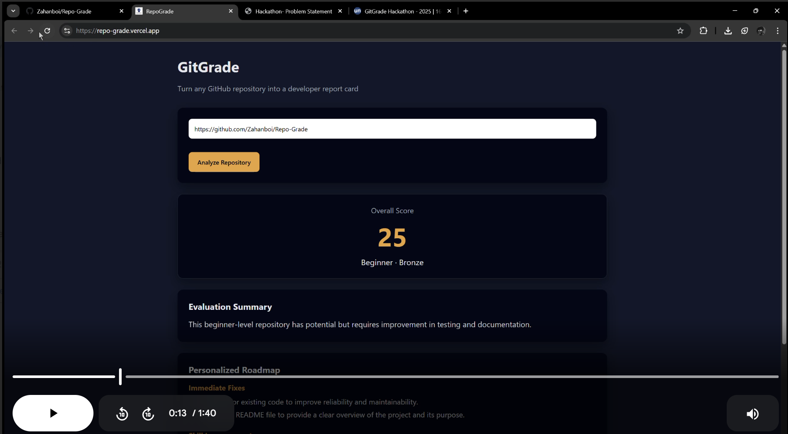
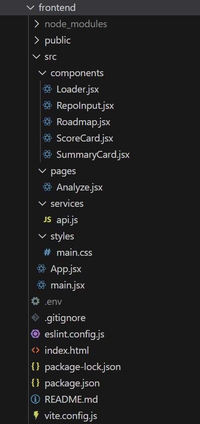
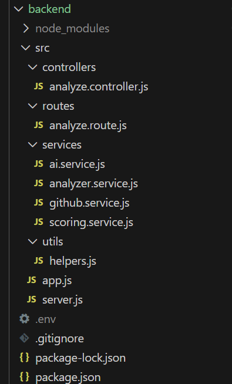

# Demo-Video Click Below see the entire working 👇

# Repo-Grade 🚀  
### Turn Any GitHub Repository into a Developer Report Card

Repo-Grade is an AI-powered web application that analyzes public GitHub repositories and generates a **numeric score, written evaluation, and personalized improvement roadmap** — like feedback from a coding mentor.

Built for the **GitGrade Hackathon** | Theme: AI + Code Analysis + Developer Profiling

---

## 🔍 Problem

Students push projects to GitHub but don't know:
- How professional their code looks
- How recruiters might evaluate it
- What steps to improve

**GitGrade provides clear, actionable feedback on any public GitHub repository.**

---

## ✨ Features

- 🔗 Accepts any **public GitHub repository URL**
- 📊 Generates **numeric score (0–100)** with level & badge
- 🧠 Evaluates: project structure, commit history, documentation, testing, tech stack
- 🤖 AI-powered mentor-style summary
- 🛡️Secure Client and Server side validation app
- 🗺️ Personalized roadmap (immediate fixes, skill improvements, best practices)
- 🌐 Fully deployed (Vercel + Render)

---

## 🚧 Future Plans & Roadmap

- Full AI integration
    - Build and deploy a dedicated "RepoGrade AI" model for deep repository analysis
    - Combine static analysis, dynamic build/runtime checks, and LLM-driven reasoning
    - Automated reproducible builds in isolated sandboxes (containerized / ephemeral VMs)

- Analysis improvements
    - Multi-language support with language-specific heuristics and linters
    - Test execution and coverage analysis when CI/tests are present
    - Dependency & supply-chain safety checks (vuln scanning, outdated deps)

- Developer tooling & automation
    - GitHub App / bot for PR review comments and automated grading on push
    - CLI tool for local scoring and pre-commit checks
    - VS Code extension surfacing scores, suggestions, and quick fixes

- Platform & integrations
    - CI/CD integrations (GitHub Actions templates, GitLab, Bitbucket)
    - Repository dashboards with trends, historical scores, and team views
    - Exportable reports & portfolio badges for resumes/GitHub profile

- Model and data improvements
    - Public dataset collection (opt-in) to fine-tune models on real repos
    - Active learning loop: accept feedback to improve grading accuracy
    - Explainability features: show evidence and code snippets that drove scores

- User experience & adoption
    - Education mode with guided remediation tasks and learning paths
    - Team/Org plans with aggregated metrics and assignment features
    - Marketplace for community rules, plugins, and custom grading presets

- Security, privacy & compliance
    - Opt-in data usage and private repo support for paid tiers
    - Data retention controls, audit logs, and enterprise compliance features

- Monetization & scaling
    - Tiered plans: free basic scoring, paid premium analysis and private repo support
    - API access for integrations and managed enterprise deployments

- Long-term vision
    - Real-time pair-programming assistant that integrates RepoGrade insights
    - Auto-generated PRs or fix branches with suggested refactors and tests
    - Community leaderboard and certification paths for developer skill recognition

## 🧮 Scoring Breakdown

| Dimension | Details |
|-----------|---------|
| Code Structure | Folder organization |
| Git Practices | Commit frequency & quality |
| Documentation | README presence |
| Testing | Test-related files |
| Professional Setup | CI, `.gitignore`, hygiene |

**Tiers:** 0–39 (Beginner), 40–69 (Intermediate), 70–100 (Advanced)

---

## 🛠️ Tech Stack

**Frontend:** React (Vite) → Vercel  
**Backend:** Node.js + Express + GitHub API + Groq LLM → Render

Frontend Strcuture 

Backend Structure 

## 🚀 Check it out Live at:
[GitGrade Live Demo](https://repo-grade.vercel.app/)
